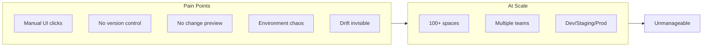
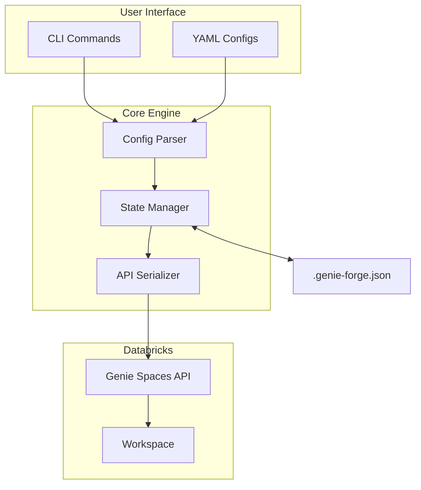
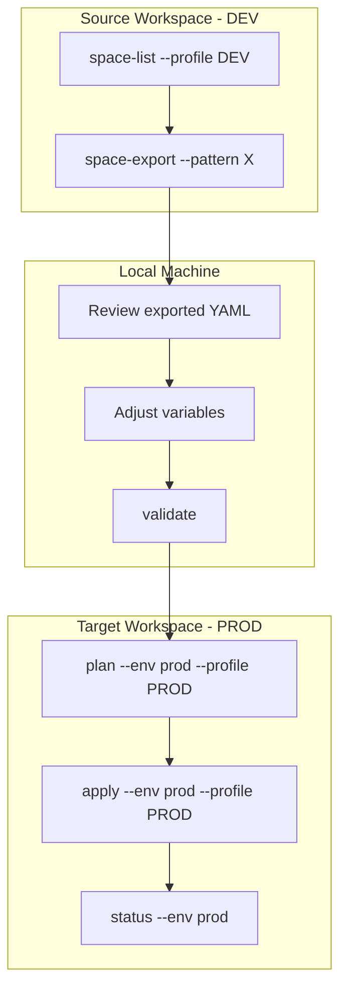

# Genie-Forge

**Terraform-like Infrastructure-as-Code for Databricks Genie Spaces**

> *"One Config, Any Workspace. Migrate in Minutes, Not Days."*

[](https://github.com/brij-raghuwanshi-db/genie-forge/actions/workflows/push.yml)
[](https://codecov.io/gh/brij-raghuwanshi-db/genie-forge)
[](https://www.python.org/downloads/)
[](https://opensource.org/licenses/Apache-2.0)
[](https://pypi.org/project/genie-forge/)

Define Databricks Genie spaces in YAML, preview changes before applying, and manage deployments across environments.

## The Problem

Managing Genie spaces through the UI doesn't scale. As your organization grows, you face:



- **Hours of clicking** to create or update spaces manually
- **No version control** — "Who changed this? When? Why?"
- **Copy-paste errors** between dev, staging, and production
- **Silent drift** when someone edits a space via the UI
- **Migration nightmare** — recreating spaces from scratch in a new workspace

## The Solution

Genie-Forge brings **Infrastructure as Code** to Databricks Genie, giving you:

| Pain Point | Without Genie-Forge | With Genie-Forge |
|------------|---------------------|------------------|
| Creating 100 spaces | Hours of clicking | `genie-forge apply` (seconds) |
| Tracking changes | "Who changed this?" | Git history |
| Deploying to prod | Copy-paste from dev | `--env prod` |
| Cross-workspace migration | Recreate from scratch | Export → Apply |
| Configuration drift | Silent, undetected | `genie-forge drift` |

### Key Capabilities

- **Infrastructure as Code** - Define spaces in YAML, version control with Git
- **Plan/Apply Workflow** - Preview changes before deploying (like Terraform)
- **State Management** - Track what's deployed, detect drift
- **Multi-Environment** - Deploy to dev/staging/prod with variable substitution
- **Cross-Workspace Migration** - Export from one workspace, deploy to another
- **Bulk Operations** - Create hundreds of spaces in seconds (~37 spaces/sec)
- **Dual Environment Support** - Run locally or in Databricks notebooks

## Workflow Overview


| Step | Command | Description |
|------|---------|-------------|
| Install | `pip install genie-forge` | Install the CLI tool |
| Init | `genie-forge init` | Create project structure |
| Configure | Edit YAML files | Define spaces in `conf/spaces/` |
| Validate | `genie-forge validate` | Check syntax and schema |
| Plan | `genie-forge plan --env dev` | Preview changes |
| Apply | `genie-forge apply --env dev` | Deploy to workspace |

## Quick Start

```bash
# Install
pip install genie-forge

# Initialize a new project
genie-forge init

# Verify your identity
genie-forge whoami --profile YOUR_PROFILE

# List available Databricks profiles
genie-forge profiles

# Validate your configuration
genie-forge validate --config conf/spaces/

# Preview changes (read-only)
genie-forge plan --env dev --profile YOUR_PROFILE

# Deploy
genie-forge apply --env dev --profile YOUR_PROFILE
```

## Installation

### From Source

```bash
git clone https://github.com/brij-raghuwanshi-db/genie-forge.git
cd genie-forge
pip install -e .
```

### From Wheel

```bash
pip install build
python -m build
pip install dist/genie_forge-0.3.0-py3-none-any.whl
```

### Verify Installation

```bash
genie-forge --version
# genie-forge, version 0.3.0
```

## Architecture



## Usage

### Define a Genie Space

```yaml
# conf/spaces/sales_analytics.yaml
version: 1

spaces:
  - space_id: "sales_analytics"
    title: "Sales Analytics Dashboard"
    warehouse_id: "${warehouse_id}"
    
    data_sources:
      tables:
        - identifier: "${catalog}.${schema}.sales"
          description:
            - "Sales transactions data"
        - identifier: "${catalog}.${schema}.customers"
          description:
            - "Customer master data"
    
    instructions:
      sample_questions:
        - question: "What are the top 10 customers by revenue?"
        - question: "Show sales trends by region"
```

### Configure Environment

```yaml
# conf/environments/dev.yaml
workspace_url: "https://your-workspace.azuredatabricks.net"

auth:
  profile: "DEV_PROFILE"

variables:
  warehouse_id: "abc123def456"
  catalog: "dev_catalog"
  schema: "analytics"
```

### Deploy

```bash
# Preview what will be created
genie-forge plan --env dev --profile DEV_PROFILE

# Apply changes
genie-forge apply --env dev --profile DEV_PROFILE

# Check status
genie-forge status --env dev

# Detect drift between local state and workspace
genie-forge drift --env dev --profile DEV_PROFILE
```

### Import Existing Spaces

```bash
# List all spaces in workspace
genie-forge space-list --profile PROD

# Import a single space by Databricks ID
genie-forge state-import 01ABCDEF123456 --env prod --as sales_dashboard --profile PROD

# Import all spaces matching a pattern
genie-forge state-import --pattern "Sales*" --env prod --profile PROD

# Export spaces to YAML files
genie-forge space-export --pattern "Sales*" --output-dir conf/spaces/ --profile PROD
```

### Create Spaces Directly

```bash
# Quick creation via CLI flags
genie-forge space-create "My Analytics Space" \
    --warehouse-id abc123 \
    --tables "catalog.schema.table1,catalog.schema.table2" \
    --profile PROD

# Create from YAML/JSON file
genie-forge space-create --from-file conf/spaces/my_space.yaml --profile PROD

# Clone an existing space
genie-forge space-clone 01ABC123DEF --name "Cloned Space" --profile PROD
```

## Cross-Workspace Migration

**Migrate in minutes, not days.** Move Genie spaces between workspaces (dev → staging → prod) with a simple workflow.

### Why This Matters

| Scenario | Without Genie-Forge | With Genie-Forge |
|----------|---------------------|------------------|
| Migrate 50 spaces to prod | Days of manual work | 10 minutes |
| Ensure consistency | "Hope it matches dev" | Exact same YAML |
| Audit trail | None | Git commits |
| Rollback | Recreate from memory | `git revert` + `apply` |
| Regional deployment | Copy-paste nightmare | Add new environment file |

### Enterprise Use Cases

- **Dev → Staging → Prod pipeline** — Standard CI/CD promotion
- **Regional deployment** — Deploy same spaces to US, EU, APAC workspaces
- **Disaster recovery** — Rebuild spaces in a new workspace from Git
- **Tenant migration** — Move customer spaces between isolated workspaces
- **Workspace consolidation** — Merge spaces from multiple workspaces

### Migration Workflow



### 1. Set Up Databricks Profiles

Configure profiles for both workspaces in `~/.databrickscfg`:

```ini
[DEV]
host = https://dev-workspace.cloud.databricks.com
token = dapi_dev_xxx

[PROD]
host = https://prod-workspace.cloud.databricks.com
token = dapi_prod_xxx
```

### 2. Configure Environments

**Dev** (`conf/environments/dev.yaml`):
```yaml
workspace_url: "https://dev-workspace.cloud.databricks.com"
variables:
  warehouse_id: "dev_warehouse_abc123"
  catalog: "dev_catalog"
  schema: "analytics"
```

**Prod** (`conf/environments/prod.yaml`):
```yaml
workspace_url: "https://prod-workspace.cloud.databricks.com"
variables:
  warehouse_id: "prod_warehouse_xyz789"
  catalog: "prod_catalog"
  schema: "analytics"
```

### 3. Export and Deploy

```bash
# Export spaces from dev workspace
genie-forge space-export --pattern "*" --output-dir conf/spaces/ --profile DEV

# Preview deployment to prod
genie-forge plan --env prod --profile PROD

# Deploy to prod workspace
genie-forge apply --env prod --profile PROD
```

The same YAML configs work across environments - only the variables change.

## CLI Commands

### Setup Commands

| Command | Description |
|---------|-------------|
| `init` | Initialize new genie-forge project with directory structure |
| `profiles` | List available Databricks CLI profiles |
| `whoami` | Show current authenticated user and workspace |

### Demo Commands

| Command | Description |
|---------|-------------|
| `setup-demo` | Create demo tables in Unity Catalog |
| `demo-status` | Check if demo objects exist |
| `cleanup-demo` | Remove demo tables (safe: dry-run by default) |

### Configuration Commands

| Command | Description |
|---------|-------------|
| `validate` | Check config syntax and schema with progress |

### Deployment Commands

| Command | Description |
|---------|-------------|
| `plan` | Preview changes with operation summary |
| `apply` | Deploy with progress bar and summary report |
| `status` | View deployment status from state file |
| `drift` | Detect drift with progress indicator |
| `destroy` | Delete spaces from workspace |

### Space Operations (`space-*`)

| Command | Description |
|---------|-------------|
| `space-list` | List all spaces in workspace with pagination |
| `space-get` | Display detailed space information |
| `space-find` | Search spaces by name pattern |
| `space-create` | Create space via CLI flags or YAML/JSON file |
| `space-clone` | Clone space within or across workspaces |
| `space-export` | Export spaces to YAML files |
| `space-delete` | Delete spaces (alias for destroy) |

### State Operations (`state-*`)

| Command | Description |
|---------|-------------|
| `state-list` | List tracked spaces in state file |
| `state-show` | View detailed state information |
| `state-pull` | Refresh state from workspace |
| `state-remove` | Remove space from state (keeps in Databricks) |
| `state-import` | Import existing spaces into management |

See [CLI Reference](docs/CLI.md) for detailed command documentation.

See [User Journeys](docs/USER-JOURNEYS.md) for workflow diagrams and scenarios.

## Features

### Current (v0.3.0)

- **Project scaffolding** - `init` command creates standard project structure
- **Identity verification** - `whoami` shows current user and workspace
- **Space operations** - `space-*` commands for CRUD operations on spaces
- **State management** - `state-*` commands for tracking and syncing
- **Progress indicators** - Real-time progress bars, counters, and summaries
- **Flexible creation** - Create spaces via CLI flags, YAML, or JSON files
- **Clone operations** - Clone spaces within or across workspaces
- **Bulk export** - Export multiple spaces to YAML files with filtering
- YAML/JSON configuration with variable substitution
- Terraform-like plan/apply/destroy workflow
- State tracking via `.genie-forge.json`
- Drift detection - Compare local state with workspace
- Import existing spaces - Bring UI-created spaces under management
- Support for all Genie space features (tables, instructions, joins, sample questions)
- Self-join support for hierarchical data
- Parallel bulk operations (~37 spaces/second)
- Retry logic with exponential backoff
- Dry-run mode for all mutating commands
- Modular CLI architecture for easy maintenance
- Authentication via Databricks CLI profiles or environment variables

### Coming Soon

- MCP server for AI agent integration
- Databricks App web UI
- CI/CD pipeline templates

## Project Structure

```
genie-forge/
├── src/genie_forge/       # Main package
│   ├── cli/               # CLI commands (modular)
│   │   ├── spaces.py      # plan, apply, destroy, status, drift
│   │   ├── space_cmd.py   # space-* commands
│   │   ├── state_cmd.py   # state-* commands
│   │   ├── validate.py    # validate command
│   │   ├── find.py        # find command
│   │   ├── import_cmd.py  # import command
│   │   ├── init.py        # init command
│   │   ├── whoami.py      # whoami command
│   │   ├── demo.py        # setup-demo, cleanup-demo, demo-status
│   │   ├── profiles.py    # profiles command
│   │   └── common.py      # Shared CLI utilities
│   ├── client.py          # Genie API client
│   ├── models.py          # Pydantic data models
│   ├── parsers.py         # YAML parsing & validation
│   ├── serializer.py      # Config serialization
│   ├── state.py           # State management
│   ├── utils.py           # Environment detection & path utilities
│   └── demo_tables.py     # Demo table utilities
├── conf/
│   ├── spaces/            # Space configurations
│   └── environments/      # Environment configs
├── docs/                  # Documentation
├── tests/                 # Test suite
└── notebooks/             # Databricks notebooks
```

## Documentation

- [CLI Reference](docs/guide/cli.md) - Complete command documentation
- [User Journeys](docs/guide/user-journeys.md) - Workflow diagrams and scenarios
- [Configuration Guide](docs/guide/configuration.md) - YAML configuration details
- [Architecture](docs/reference/architecture.md) - How Genie-Forge works internally
- [Troubleshooting](docs/guide/troubleshooting.md) - Common issues and solutions

**Full documentation site**: Run `mkdocs serve` to preview locally.

## Python API

### Basic Usage

```python
from genie_forge import GenieClient, StateManager
from genie_forge.parsers import MetadataParser

# Load and validate configuration
parser = MetadataParser(env="prod")
configs = parser.parse_directory("conf/spaces/")

# Create client and plan deployment
client = GenieClient(profile="PROD_PROFILE")
state = StateManager()
plan = state.plan(configs, client, env="prod")

# Apply changes
if plan.has_changes:
    results = state.apply(plan, client)
    print(f"Created: {len(results['created'])}")
```

### Environment Detection & Path Management

Genie-Forge automatically detects whether it's running locally or on Databricks:

```python
from genie_forge import ProjectPaths, is_running_on_databricks

# Check environment
if is_running_on_databricks():
    print("Running on Databricks cluster")
else:
    print("Running locally")

# ProjectPaths auto-configures paths for the current environment
# Same catalog/schema used for both data tables and Volume storage
paths = ProjectPaths(
    project_name="my_project",
    catalog="main",           # Unity Catalog name
    schema="default",         # Schema name
    volume_name="genie_forge" # Volume for file storage
)

# On Databricks: /Volumes/main/default/genie_forge/my_project/
# On Local:      ~/.genie-forge/my_project/
print(f"Project root: {paths.root}")
print(f"State file:   {paths.state_file}")
print(f"Configs:      {paths.spaces_dir}")

# Access catalog/schema for table references
print(f"Tables at:    {paths.catalog}.{paths.schema}.*")
```

### Available Utilities

```python
from genie_forge import (
    # Environment detection
    is_running_on_databricks,
    is_running_in_notebook,
    get_databricks_runtime_version,
    
    # Path utilities
    ProjectPaths,
    get_volume_path,
    is_volume_path,
    parse_volume_path,
    ensure_directory,
    
    # Helpers
    sanitize_name,
)
```

## Testing

```bash
# Install dev dependencies
pip install -r requirements-dev.txt

# Run unit tests
pytest tests/unit/ -v

# Run with coverage
pytest tests/unit/ --cov=genie_forge --cov-report=html
```

## Contributing

1. Fork the repository
2. Create a feature branch (`git checkout -b feature/new-feature`)
3. Make your changes
4. Run tests (`pytest tests/`)
5. Submit a pull request

## License

Apache License 2.0

---

**Author**: Brijendra Singh Raghuwanshi

**Forge your enterprise Genie spaces at scale.**

