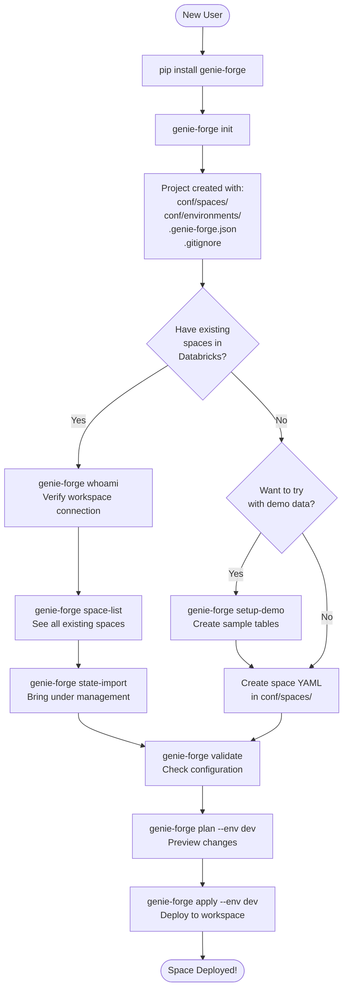
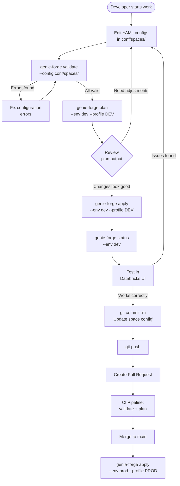
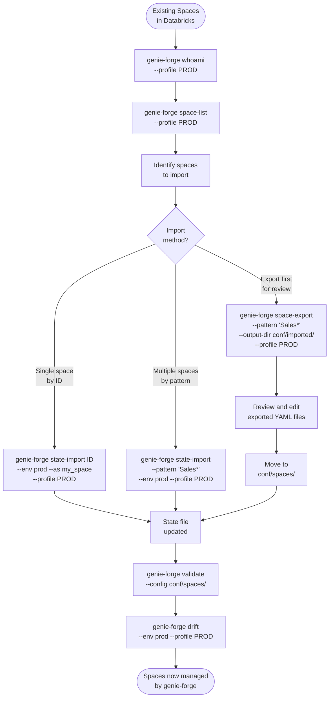
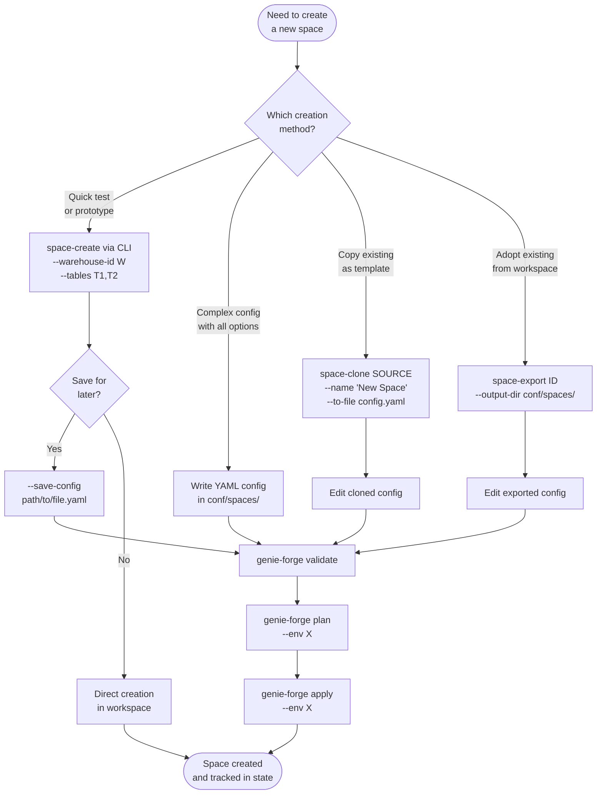
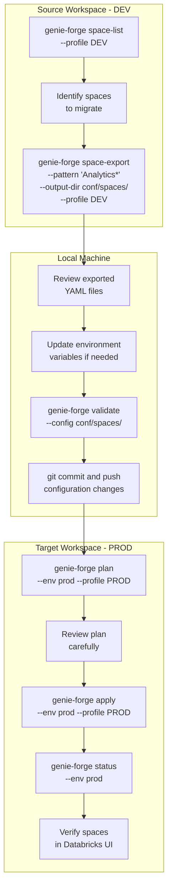
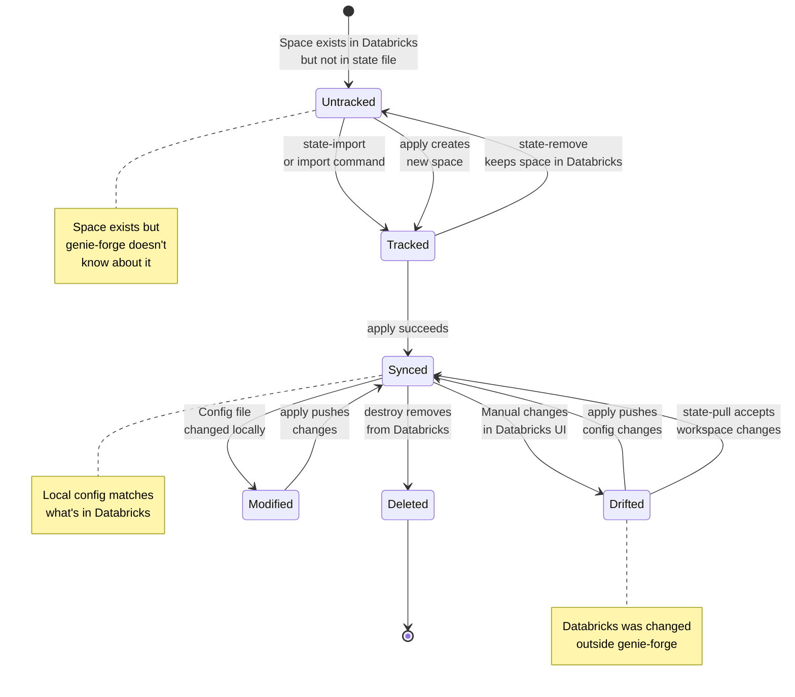
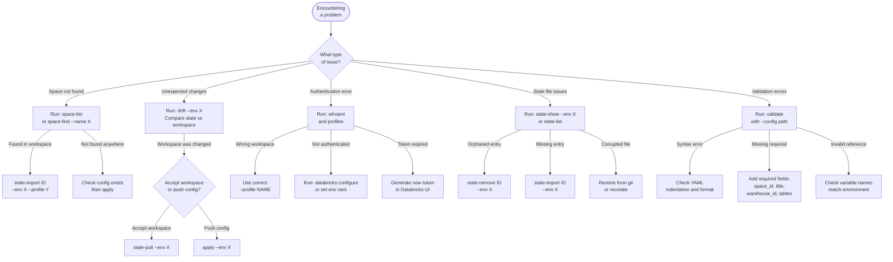
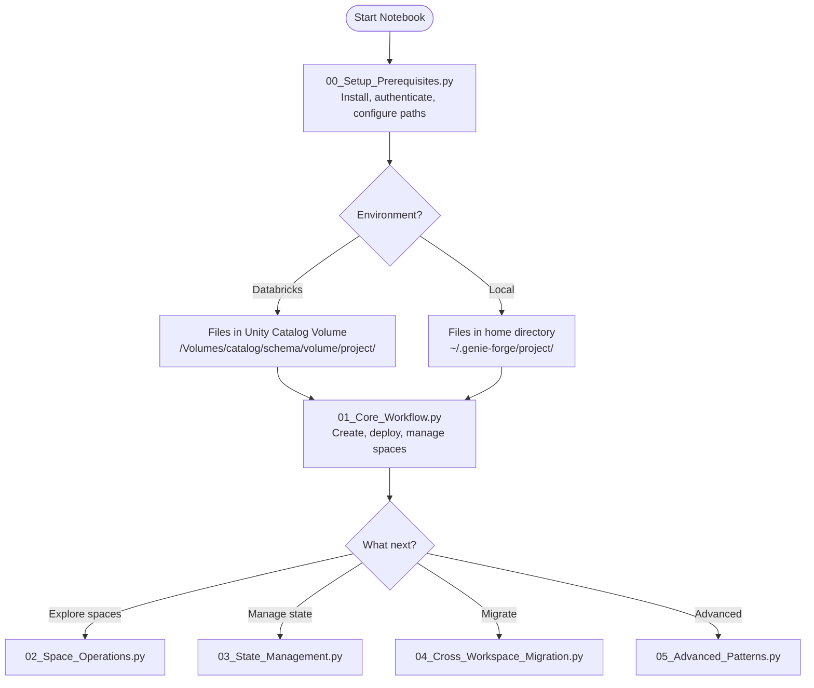

# User Journeys and Scenarios

This document provides comprehensive workflow diagrams and step-by-step guides for common genie-forge use cases.

## Table of Contents

1. [New User Journey (Getting Started)](#1-new-user-journey-getting-started)
2. [Daily Development Workflow](#2-daily-development-workflow)
3. [Import Existing Spaces](#3-import-existing-spaces)
4. [Multi-Environment Deployment](#4-multi-environment-deployment)
5. [Space Creation Methods](#5-space-creation-methods)
6. [Cross-Workspace Migration](#6-cross-workspace-migration)
7. [State Lifecycle](#7-state-lifecycle)
8. [Troubleshooting Guide](#8-troubleshooting-guide)
9. [Using Notebooks](#9-using-notebooks)

---

## 1. New User Journey (Getting Started)

This diagram shows the complete onboarding flow from installation to your first deployed Genie space.



### Step-by-Step Walkthrough

#### Step 1: Install genie-forge

```bash
# Option A: From PyPI (when published)
pip install genie-forge

# Option B: From source
git clone https://github.com/brij-raghuwanshi-db/genie-forge.git
cd genie-forge
pip install -e .
```

#### Step 2: Initialize your project

```bash
# Create a new genie-forge project
genie-forge init

# This creates:
# conf/
#   spaces/           <- Your space configurations go here
#     example.yaml    <- Example configuration
#   environments/     <- Environment-specific variables
#     dev.yaml        <- Development environment
#     prod.yaml       <- Production environment
# .genie-forge.json   <- State file (tracks deployments)
# .gitignore          <- Updated with genie-forge patterns
```

#### Step 3: Configure Databricks authentication

```bash
# Check available profiles
genie-forge profiles

# Verify connection
genie-forge whoami --profile YOUR_PROFILE
```

#### Step 4: Create your first space configuration

Create `conf/spaces/my_first_space.yaml`:

```yaml
version: 1

spaces:
  - space_id: "my_first_space"
    title: "My First Genie Space"
    warehouse_id: "${warehouse_id}"
    
    data_sources:
      tables:
        - identifier: "${catalog}.${schema}.my_table"
          description:
            - "Description of my table"
    
    instructions:
      sample_questions:
        - question: "What is the total count?"
```

#### Step 5: Configure environment variables

Edit `conf/environments/dev.yaml`:

```yaml
workspace_url: "https://your-workspace.cloud.databricks.com"

variables:
  warehouse_id: "your_warehouse_id"
  catalog: "your_catalog"
  schema: "your_schema"
```

#### Step 6: Validate, plan, and apply

```bash
# Validate configuration
genie-forge validate --config conf/spaces/

# Preview changes
genie-forge plan --env dev --profile YOUR_PROFILE

# Deploy
genie-forge apply --env dev --profile YOUR_PROFILE
```

### Why This Flow?

- **`init` first**: Creates a consistent project structure
- **`whoami` verification**: Ensures you're connected to the right workspace
- **`validate` before `plan`**: Catches configuration errors early
- **`plan` before `apply`**: Shows exactly what will change before making changes

---

## 2. Daily Development Workflow

This diagram shows the typical edit-validate-plan-apply cycle that developers use daily.



### Step-by-Step Walkthrough

#### Morning: Start Development

```bash
# Pull latest changes
git pull origin main

# Check current status
genie-forge status --env dev

# Verify your identity
genie-forge whoami --profile DEV
```

#### Make Changes

Edit your space configuration files in `conf/spaces/`.

#### Validate and Test Locally

```bash
# Validate syntax
genie-forge validate --config conf/spaces/

# Preview changes
genie-forge plan --env dev --profile DEV

# Apply to dev environment
genie-forge apply --env dev --profile DEV
```

#### Test in Databricks

1. Open the Databricks workspace
2. Navigate to Genie Spaces
3. Find your space and test the queries
4. Verify the space behaves as expected

#### Commit and Push

```bash
git add conf/spaces/
git commit -m "Update sales analytics space with new metrics"
git push origin feature/sales-metrics
```

#### CI/CD Pipeline

Your CI pipeline should include:

```yaml
# Example GitHub Actions
- name: Validate configs
  run: genie-forge validate --config conf/spaces/ --strict

- name: Plan changes
  run: genie-forge plan --env staging --profile STAGING
  env:
    DATABRICKS_HOST: ${{ secrets.DATABRICKS_HOST }}
    DATABRICKS_TOKEN: ${{ secrets.DATABRICKS_TOKEN }}
```

### Why This Flow?

- **Validate early**: Catches typos and schema errors before they reach production
- **Plan always**: No surprises when applying changes
- **Test before commit**: Ensures changes work in real Databricks environment
- **CI validation**: Prevents broken configs from being merged

---

## 3. Import Existing Spaces

This diagram shows how to bring UI-created spaces under genie-forge management.



### Step-by-Step Walkthrough

#### Method 1: Import Single Space

Use when you know the exact space you want to import.

```bash
# 1. Find the space
genie-forge space-list --profile PROD

# 2. Import with a custom logical ID
genie-forge state-import 01ABC123DEF456 \
    --env prod \
    --as sales_analytics \
    --profile PROD

# 3. Verify import
genie-forge state-list --env prod
```

#### Method 2: Import by Pattern

Use when importing multiple related spaces.

```bash
# 1. Preview what will be imported
genie-forge state-import --pattern "Sales*" \
    --env prod \
    --dry-run \
    --profile PROD

# 2. Import all matching spaces
genie-forge state-import --pattern "Sales*" \
    --env prod \
    --profile PROD

# 3. Verify imports
genie-forge state-list --env prod
```

#### Method 3: Export, Review, Then Import

Use when you want to review and potentially modify configurations before importing.

```bash
# 1. Export spaces to YAML files
genie-forge space-export --pattern "Sales*" \
    --output-dir conf/imported/ \
    --profile PROD

# 2. Review the exported files
ls conf/imported/

# 3. Edit as needed
vim conf/imported/sales_analytics.yaml

# 4. Move to main config directory
mv conf/imported/*.yaml conf/spaces/

# 5. Validate
genie-forge validate --config conf/spaces/

# 6. Check for drift
genie-forge drift --env prod --profile PROD
```

### Use Cases

| Scenario | Recommended Method |
|----------|-------------------|
| Import one critical space | Single import with `--as` |
| Import a project's spaces | Pattern import |
| Audit before adopting | Export first |
| Migrating to genie-forge | Export first |

### Why This Flow?

- **Multiple import methods**: Different scenarios need different approaches
- **Export for safety**: Review what you're importing before committing
- **Validate after import**: Ensures imported configs are valid
- **Drift check**: Confirms state matches workspace

---

## 4. Multi-Environment Deployment

This diagram shows the dev -> staging -> prod promotion workflow.

```mermaid
flowchart LR
    subgraph DEV [Development]
        direction TB
        D1[Edit YAML<br/>configs] --> D2[validate]
        D2 --> D3[plan --env dev]
        D3 --> D4[apply --env dev]
        D4 --> D5[Test in<br/>dev workspace]
    end
    
    subgraph STAGING [Staging]
        direction TB
        S1[plan --env staging] --> S2[apply --env staging]
        S2 --> S3[QA Testing<br/>and validation]
    end
    
    subgraph PROD [Production]
        direction TB
        P1[plan --env prod] --> P2[Review with<br/>stakeholders]
        P2 --> P3[apply --env prod<br/>--auto-approve]
        P3 --> P4[Monitor<br/>and verify]
    end
    
    D5 -->|PR Approved| S1
    S3 -->|QA Passed| P1
```



### Environment Configuration

#### `conf/environments/dev.yaml`

```yaml
workspace_url: "https://dev-workspace.cloud.databricks.com"

variables:
  warehouse_id: "dev_warehouse_abc123"
  catalog: "dev_catalog"
  schema: "analytics"
  environment_tag: "development"
```

#### `conf/environments/staging.yaml`

```yaml
workspace_url: "https://staging-workspace.cloud.databricks.com"

variables:
  warehouse_id: "staging_warehouse_def456"
  catalog: "staging_catalog"
  schema: "analytics"
  environment_tag: "staging"
```

#### `conf/environments/prod.yaml`

```yaml
workspace_url: "https://prod-workspace.cloud.databricks.com"

variables:
  warehouse_id: "prod_warehouse_xyz789"
  catalog: "prod_catalog"
  schema: "analytics"
  environment_tag: "production"
```

### Databricks Profiles

`~/.databrickscfg`:

```ini
[DEV]
host = https://dev-workspace.cloud.databricks.com
token = dapi_dev_xxx

[STAGING]
host = https://staging-workspace.cloud.databricks.com
token = dapi_staging_xxx

[PROD]
host = https://prod-workspace.cloud.databricks.com
token = dapi_prod_xxx
```

### Deployment Commands

```bash
# Development
genie-forge plan --env dev --profile DEV
genie-forge apply --env dev --profile DEV

# Staging (after PR merge)
genie-forge plan --env staging --profile STAGING
genie-forge apply --env staging --profile STAGING

# Production (after QA approval)
genie-forge plan --env prod --profile PROD
genie-forge apply --env prod --profile PROD --auto-approve  # For CI/CD
```

### CI/CD Pipeline Example

```yaml
# GitHub Actions example
name: Deploy Genie Spaces

on:
  push:
    branches: [main]
    paths: ['conf/spaces/**']

jobs:
  deploy-staging:
    runs-on: ubuntu-latest
    steps:
      - uses: actions/checkout@v3
      
      - name: Setup Python
        uses: actions/setup-python@v4
        with:
          python-version: '3.9'
      
      - name: Install genie-forge
        run: pip install genie-forge
      
      - name: Validate
        run: genie-forge validate --config conf/spaces/ --strict
      
      - name: Plan Staging
        run: genie-forge plan --env staging
        env:
          DATABRICKS_HOST: ${{ secrets.STAGING_HOST }}
          DATABRICKS_TOKEN: ${{ secrets.STAGING_TOKEN }}
      
      - name: Apply Staging
        run: genie-forge apply --env staging --auto-approve
        env:
          DATABRICKS_HOST: ${{ secrets.STAGING_HOST }}
          DATABRICKS_TOKEN: ${{ secrets.STAGING_TOKEN }}

  deploy-prod:
    needs: deploy-staging
    runs-on: ubuntu-latest
    environment: production  # Requires approval
    steps:
      # Similar steps for production
```

### Why This Flow?

- **Environment isolation**: Each environment has its own workspace and variables
- **Promotion gates**: Changes must pass through dev and staging before prod
- **Same configs**: The YAML files are identical; only variables change
- **Automated deployment**: CI/CD ensures consistent deployments

---

## 5. Space Creation Methods

This diagram shows all the different ways to create a new Genie space.



### Method 1: CLI Flags (Quick Prototyping)

Best for: Quick tests, prototypes, one-off spaces

```bash
# Minimal space
genie-forge space-create "Quick Test Space" \
    --warehouse-id abc123 \
    --tables "catalog.schema.table1" \
    --profile DEV

# With more options
genie-forge space-create "Sales Analytics" \
    --warehouse-id abc123 \
    --tables "catalog.schema.sales,catalog.schema.customers" \
    --description "Analyze sales performance" \
    --instructions "Focus on revenue and customer metrics" \
    --questions "Top 10 customers by revenue?" \
    --questions "Monthly sales trend?" \
    --profile DEV

# Create and save config for future use
genie-forge space-create "Reusable Space" \
    --warehouse-id abc123 \
    --tables "catalog.schema.data" \
    --save-config conf/spaces/reusable_space.yaml \
    --profile DEV
```

### Method 2: YAML Configuration (Full Control)

Best for: Production spaces, complex configurations, version control

```yaml
# conf/spaces/sales_analytics.yaml
version: 1

spaces:
  - space_id: "sales_analytics"
    title: "Sales Analytics Dashboard"
    warehouse_id: "${warehouse_id}"
    description: "Comprehensive sales analysis"
    
    data_sources:
      tables:
        - identifier: "${catalog}.${schema}.sales"
          description:
            - "Daily sales transactions"
          column_configs:
            - column_name: "revenue"
              description: "Transaction revenue in USD"
            - column_name: "region"
              description: "Sales region code"
              synonyms: ["area", "territory"]
        
        - identifier: "${catalog}.${schema}.customers"
          description:
            - "Customer master data"
    
    instructions:
      text_instructions:
        - content: "Always break down analysis by region when asked about sales."
        - content: "Use customer_segment for grouping customers."
      
      sql_functions:
        - identifier: "${catalog}.${schema}.calculate_margin"
          description: "Calculates profit margin percentage"
      
      example_question_sqls:
        - question: "What is the total revenue?"
          sql: "SELECT SUM(revenue) FROM ${catalog}.${schema}.sales"
    
    sample_questions:
      - question: "Top 10 customers by revenue this quarter?"
      - question: "Sales trend by region for the last 6 months?"
      - question: "Which products have the highest margin?"
```

Then deploy:

```bash
genie-forge validate --config conf/spaces/sales_analytics.yaml
genie-forge plan --env dev --profile DEV
genie-forge apply --env dev --profile DEV
```

### Method 3: Clone Existing Space

Best for: Creating variations of existing spaces, templates

```bash
# Clone to a file for editing
genie-forge space-clone 01ABC123DEF456 \
    --name "Sales Analytics (Q4 Version)" \
    --to-file conf/spaces/sales_q4.yaml \
    --profile PROD

# Edit the cloned config
vim conf/spaces/sales_q4.yaml

# Deploy the modified clone
genie-forge validate --config conf/spaces/sales_q4.yaml
genie-forge plan --env dev --profile DEV
genie-forge apply --env dev --profile DEV
```

```bash
# Clone directly to workspace (same workspace)
genie-forge space-clone 01ABC123DEF456 \
    --name "Sales Analytics Copy" \
    --to-workspace \
    --profile PROD

# Clone across workspaces
genie-forge space-clone 01ABC123DEF456 \
    --name "Sales Analytics" \
    --to-workspace \
    --profile DEV \
    --target-profile PROD \
    --warehouse-id prod_warehouse_xyz
```

### Method 4: Export and Modify

Best for: Adopting existing spaces, creating templates from production

```bash
# Export from workspace
genie-forge space-export \
    --space-id 01ABC123DEF456 \
    --output-dir conf/spaces/ \
    --profile PROD

# Edit the exported config
vim conf/spaces/sales_analytics.yaml

# Deploy (will update existing or create new based on state)
genie-forge plan --env dev --profile DEV
genie-forge apply --env dev --profile DEV
```

### Decision Guide

| Scenario | Recommended Method |
|----------|-------------------|
| Quick test/POC | CLI flags |
| Production space | YAML file |
| Copy existing space | Clone |
| Adopt UI-created space | Export |
| Template for team | YAML file in repo |
| One-time creation | CLI flags |
| CI/CD managed | YAML file |

---

## 6. Cross-Workspace Migration

This diagram shows how to migrate spaces between Databricks workspaces.



### Complete Migration Walkthrough

#### Step 1: Prepare Source Workspace

```bash
# Connect to source workspace
genie-forge whoami --profile DEV

# List all spaces
genie-forge space-list --profile DEV

# Export spaces you want to migrate
genie-forge space-export \
    --pattern "*" \
    --exclude "Test*" \
    --exclude "*_backup" \
    --output-dir conf/spaces/ \
    --profile DEV
```

#### Step 2: Review and Adjust Configurations

Check the exported YAML files:

```bash
ls -la conf/spaces/

# Review each file
cat conf/spaces/sales_analytics.yaml
```

Ensure your environment files have the correct target variables:

```yaml
# conf/environments/prod.yaml
workspace_url: "https://prod-workspace.cloud.databricks.com"

variables:
  warehouse_id: "prod_warehouse_xyz789"  # Different from dev!
  catalog: "prod_catalog"                # Different from dev!
  schema: "analytics"
```

#### Step 3: Validate and Plan

```bash
# Validate configurations
genie-forge validate --config conf/spaces/

# Plan deployment to target
genie-forge plan --env prod --profile PROD
```

Review the plan output carefully:

```
═══════════════════════════════════════════════════════
Plan for environment: prod
═══════════════════════════════════════════════════════

OPERATION SUMMARY
─────────────────────────────────────────────────────
  + Create:    15 space(s)
  = Unchanged:  0 space(s)
─────────────────────────────────────────────────────

+ CREATE  sales_analytics
+ CREATE  customer_insights
+ CREATE  inventory_tracker
...
```

#### Step 4: Deploy to Target

```bash
# Apply to production
genie-forge apply --env prod --profile PROD

# Verify deployment
genie-forge status --env prod

# Check for any drift
genie-forge drift --env prod --profile PROD
```

#### Step 5: Verify in Target Workspace

1. Open the production Databricks workspace
2. Navigate to Genie Spaces
3. Verify each migrated space appears correctly
4. Test sample queries in each space

### Migration Scenarios

| Scenario | Approach |
|----------|----------|
| Dev to Prod | Export from dev, apply to prod |
| Workspace consolidation | Export from multiple sources, apply to single target |
| Disaster recovery | Restore from version-controlled configs |
| Environment refresh | Export from prod, apply to dev/staging |

### Best Practices

1. **Always export first**: Don't rely on manual recreation
2. **Review configs**: Check for hardcoded values that need updating
3. **Use environment variables**: `${warehouse_id}` instead of hardcoded IDs
4. **Test in staging**: Migrate to staging before production
5. **Version control**: Commit configs before and after migration

---

## 7. State Lifecycle

This diagram shows how spaces transition through different states.



### State Transitions Explained

#### Untracked → Tracked

A space becomes tracked when:

```bash
# Import an existing space
genie-forge state-import 01ABC123DEF456 --env prod --profile PROD

# Or create a new space via apply
genie-forge apply --env dev --profile DEV
```

#### Tracked → Synced

After a successful apply:

```bash
genie-forge apply --env dev --profile DEV
# State is now "synced" - local config matches workspace
```

#### Synced → Drifted

When someone modifies the space directly in Databricks UI:

```bash
# Detect drift
genie-forge drift --env dev --profile DEV

# Output shows:
# Drifted: sales_analytics
#   - title changed: "Sales Analytics" -> "Sales Analytics (Updated)"
```

#### Drifted → Synced (Option 1: Push local config)

```bash
# Apply your local config, overwriting workspace changes
genie-forge apply --env dev --profile DEV
```

#### Drifted → Synced (Option 2: Accept workspace changes)

```bash
# Pull changes from workspace into state
genie-forge state-pull --env dev --profile DEV

# Then update your YAML config to match
```

#### Tracked → Untracked (state-remove)

Remove from tracking without deleting from Databricks:

```bash
# Stop managing this space
genie-forge state-remove old_space --env dev

# Space still exists in Databricks, just not tracked
```

#### Synced → Deleted (destroy)

Delete from both state and Databricks:

```bash
# Remove from Databricks and state
genie-forge destroy --env dev --target old_space --profile DEV
```

### State File Structure

The `.genie-forge.json` file tracks all managed spaces:

```json
{
  "version": 1,
  "environments": {
    "dev": {
      "workspace_url": "https://dev-workspace.cloud.databricks.com",
      "last_applied": "2024-01-15T10:30:00Z",
      "spaces": {
        "sales_analytics": {
          "databricks_space_id": "01ABC123DEF456",
          "title": "Sales Analytics",
          "config_hash": "a1b2c3d4",
          "created_at": "2024-01-10T08:00:00Z",
          "updated_at": "2024-01-15T10:30:00Z"
        }
      }
    },
    "prod": {
      "workspace_url": "https://prod-workspace.cloud.databricks.com",
      "last_applied": "2024-01-14T15:00:00Z",
      "spaces": {
        "sales_analytics": {
          "databricks_space_id": "01XYZ789ABC",
          "title": "Sales Analytics",
          "config_hash": "a1b2c3d4",
          "created_at": "2024-01-14T15:00:00Z",
          "updated_at": "2024-01-14T15:00:00Z"
        }
      }
    }
  }
}
```

---

## 8. Troubleshooting Guide

This diagram shows how to diagnose and resolve common issues.



### Common Issues and Solutions

#### Issue: "Authentication failed"

**Symptoms:**
```
Error: Authentication failed: ...
```

**Solutions:**

```bash
# 1. Check your profile exists
genie-forge profiles

# 2. Verify connection
genie-forge whoami --profile YOUR_PROFILE

# 3. Check environment variables
echo $DATABRICKS_HOST
echo $DATABRICKS_TOKEN

# 4. Reconfigure profile
databricks configure --profile YOUR_PROFILE
```

#### Issue: "Space not found in workspace"

**Symptoms:**
```
Error: Space 01ABC123 not found
```

**Solutions:**

```bash
# 1. List all spaces to verify
genie-forge space-list --profile YOUR_PROFILE

# 2. Search by name
genie-forge space-find --name "*analytics*" --profile YOUR_PROFILE

# 3. Check if you're in the right workspace
genie-forge whoami --profile YOUR_PROFILE
```

#### Issue: "Drift detected"

**Symptoms:**
```
Drifted: sales_analytics
  - title: "Sales Analytics" -> "Sales Analytics (Updated)"
```

**Solutions:**

```bash
# Option 1: Accept workspace changes
genie-forge state-pull --env dev --profile DEV
# Then update your YAML to match

# Option 2: Push your config
genie-forge apply --env dev --profile DEV
# This overwrites workspace changes
```

#### Issue: "State file not found"

**Symptoms:**
```
Warning: State file not found: .genie-forge.json
```

**Solutions:**

```bash
# 1. Initialize project (creates empty state)
genie-forge init

# 2. Or run apply to create state
genie-forge apply --env dev --profile DEV
```

#### Issue: "Validation failed"

**Symptoms:**
```
Error: Invalid configuration in sales_analytics.yaml
  - Missing required field: warehouse_id
```

**Solutions:**

```bash
# 1. Validate to see all errors
genie-forge validate --config conf/spaces/

# 2. Check required fields exist:
#    - space_id
#    - title  
#    - warehouse_id
#    - data_sources.tables (at least one)

# 3. Check variable references match environment
cat conf/environments/dev.yaml
```

#### Issue: "Orphaned state entry"

**Symptoms:**
Space exists in state but was deleted from Databricks.

**Solutions:**

```bash
# Remove from state (doesn't affect Databricks)
genie-forge state-remove orphaned_space --env dev
```

### Diagnostic Commands Cheatsheet

| Symptom | Diagnostic Command |
|---------|-------------------|
| Auth issues | `genie-forge whoami --profile X` |
| Wrong workspace | `genie-forge profiles` |
| Space not found | `genie-forge space-list --profile X` |
| Drift issues | `genie-forge drift --env X --profile Y` |
| State problems | `genie-forge state-show --env X` |
| Config errors | `genie-forge validate --config path/` |

### Getting Help

```bash
# General help
genie-forge --help

# Command-specific help
genie-forge apply --help
genie-forge space-create --help

# Check version
genie-forge --version
```

---

## Summary

| Journey | When to Use | Key Commands |
|---------|------------|--------------|
| New User | First time using genie-forge | `init`, `validate`, `plan`, `apply` |
| Daily Development | Regular development work | `validate`, `plan`, `apply`, `status` |
| Import Existing | Adopting existing spaces | `space-list`, `state-import`, `space-export` |
| Multi-Environment | Dev/staging/prod workflow | `plan`, `apply` with different `--env` |
| Space Creation | Creating new spaces | `space-create`, YAML files, `space-clone` |
| Cross-Workspace | Migrating between workspaces | `space-export`, `plan`, `apply` |
| State Management | Managing tracked spaces | `state-*` commands |
| Troubleshooting | Diagnosing issues | `whoami`, `drift`, `state-show` |
| Notebooks | Interactive development in Databricks | Python API with `ProjectPaths` |

---

## 9. Using Notebooks

Genie-forge provides Databricks notebooks for interactive workflows. The notebooks automatically detect the execution environment and use appropriate paths.

### Available Notebooks

| Notebook | Purpose |
|----------|---------|
| `00_Setup_Prerequisites.py` | Initial setup, authentication, and environment configuration |
| `01_Core_Workflow.py` | validate → plan → apply → status → destroy workflow |
| `02_Space_Operations.py` | space-list, space-get, space-find, space-export, space-clone |
| `03_State_Management.py` | state-list, state-show, state-import, state-remove |
| `04_Cross_Workspace_Migration.py` | Migrating spaces between workspaces |
| `05_Advanced_Patterns.py` | Bulk operations, dynamic configs, CI/CD integration |

### Environment-Aware Paths

Notebooks use `ProjectPaths` for automatic path configuration:

```python
from genie_forge import ProjectPaths, is_running_on_databricks

# Configuration - same catalog/schema for tables AND file storage
CATALOG = "main"
SCHEMA = "default"
VOLUME_NAME = "genie_forge"
PROJECT_NAME = "demo"

# Auto-configures paths based on environment
paths = ProjectPaths(
    project_name=PROJECT_NAME,
    catalog=CATALOG,
    schema=SCHEMA,
    volume_name=VOLUME_NAME
)

# On Databricks: /Volumes/main/default/genie_forge/demo/
# On Local:      ~/.genie-forge/demo/
print(f"Root: {paths.root}")
print(f"State: {paths.state_file}")
```

### Notebook Workflow Diagram



### Key Principle: Unified Catalog/Schema

In notebooks, the same `CATALOG` and `SCHEMA` are used for:

1. **Data Tables** - Tables that Genie spaces query
   ```sql
   SELECT * FROM {CATALOG}.{SCHEMA}.employees
   ```

2. **Volume Storage** - Configuration and state files
   ```python
   /Volumes/{CATALOG}/{SCHEMA}/{VOLUME_NAME}/{PROJECT_NAME}/
   ```

This simplifies configuration - define catalog and schema once, use everywhere.
